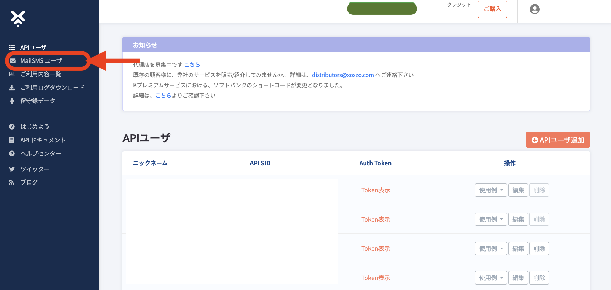
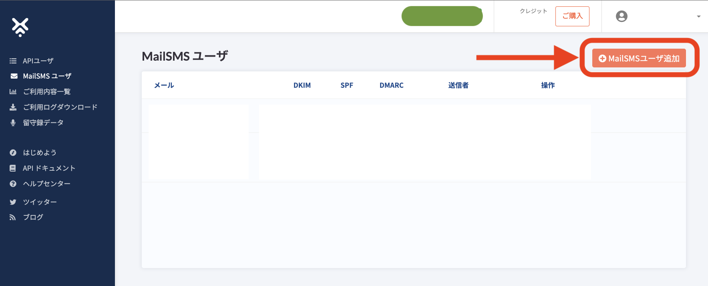
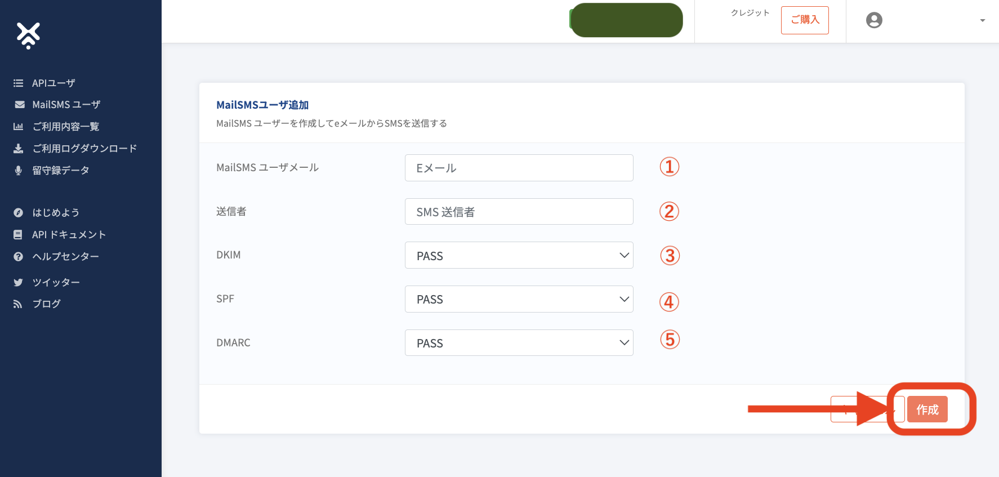

Title: MailSMS を使って、SMSを送信するには？
Date: 2023-07-05
Slug: how-to-send-via-mail2sms
Lang: ja
Category: Xoxzo Cloud Telephony/SMS API

Mail2SMSは、簡単な初期設定を行うと、Eメールを使ってSMSの送信ができるシステムです。 
 

 
 

##初期設定
1. アカウントにログインし、左側メニューより Mail2SMSユーザーを選ぶ 
 
2. 画面右上の Mail2SMSユーザ追加 ボタンをクリック 
 
3. 画面上の各項目を設定し、作成ボタンをクリック 
 

<table border="1" cellpadding="3">
<tr>
<td>①</td>
<td>MailSMS ユーザメール</td>
<td>SMS送信に使いたいメールアドレスを入力してください</td>
</tr>
<tr>
<td>②</td>
<td>送信者</td>
<td>SMSの送信者表示（送信元ID）を設定してください <a href="https://help.xoxzo.com/ja/xoxzo-cloud-telephony/sms-api/articles/what-does-sender-id-do-xoxzo/">※送信元IDとは？</a></td>
</tr>
<tr>
<td>③</td>
<td><a href="#dkim">DKIM</a></td>
<td rowspan="3"><a href="#dkim">DKIM</a>、<a href="#spf">SPF</a>、<a href="#dmarc">DMARC</a>の各基準に対し、送信前にメールのセキュリティが判定されます。ここで設定した基準（PASS/FAIL/GRAY）以上の判定結果の場合にのみ、SMS送信が行われます。詳細は、各基準の記述をご参照ください。 <a href="#sample">※合否判定と設定による送信可否の例</a></td>
</tr>
<tr>
<td>④</td>
<td><a href="#spf">SPF</a></td>
</tr>
<tr>
<td>⑤</td>
<td><a href="#dmarc">DMARC</a></td>
</tr>
</table>

**追記**
メッセージの各基準に対する判定については、送信前にお試しいただくことができます。DKIM、SPF、DKIMのセキュリティーステータスの確認には、Mail2SMSユーザーとして登録したメールアドレスから verdict@acrt-mail.jp へメールを送信してください。判定結果が返信されます。 
 
これで、初期設定は完了です。 

※初期設定では、Mail2SMSユーザは1アカウントあたり1ユーザに限定されています。 
登録ユーザ数を増やす場合、<a href="mailto:help@xoxzo.com?subject=Mail2SMSユーザ追加希望">ヘルプデスク</a> へご連絡ください。 

では、実際にSMS送信のためのeメールを送信してみましょう！ 

 

##SMS送信方法

上記で設定を済ませたメールアカウントから、新規Eメールを作成します。

<table border="1" cellpadding="3">
<tr>
<td>差出人</td>
<td>必ず登録済みのメールアドレスを使ってください</td>
</tr>
<tr>
<td>宛先</td>
<td>819012345678@mail2sms.xoxzo.com (下記※1参照)</td>
</tr>
<tr>
<td>件名</td>
<td>空白でも何か記入しても結構です</td>
</tr>
<tr>
<td>本文</td>
<td>送信するSMSの本文 
※本文の文字数制限は、通常のSMS送信時と同様です。 
<a href="https://help.xoxzo.com/ja/xoxzo-cloud-telephony/sms-api/articles/how-many-characters-would-fit-within-1-x-sms/">詳しくはこちらをご参照ください</a></td>
</tr>
</table>

※1
宛先のメールアドレスは、SMSの送信先携帯電話番号と @mail2sms.xoxzo.com をスペースを開けずに入力してください。送信先の携帯電話番号を入力する際は、次のことにご留意ください。
<ul style="list-style-type:circle;">
<li>宛先電話番号の最初の文字は、半角の + としてください。</li>
<li>日本国内への送信には、国番号 81 を続けてください。</li>
<li>国内の送信に使える宛先の電話番号は、070、080、090で始まるものです。上記への入力時には最初の 0（ゼロ）をとって、国番号に続けて入力してください。</li>
<li>宛先電話番号は、13桁になります。それより長くても短くても、エラーとなりますのでご注意ください。</li>
</ul>
例）宛先の電話番号が 080-1234-5678 の場合 : 入力は、+818012345678 としてください。
 
ご利用のメール送信ソフトにて、宛先を登録しておくと、送信先のお名前で管理が可能となり便利にお使いいただけます。
 
 
**メールのモード**  
テキストモード・HTML混在モードの場合、本文をそのままSMS送信します 
HTMLモードの場合、テキスト抽出が送信者の意図と異なる結果になる可能性があります。必ず事前にテスト送信して、配信されたSMSにて抽出結果をご確認ください。 
**大量送信**  
短時間で大量のメールを MailSMSへ送信すると、通数制限が適用され、SMS送信エラーが発生する可能性があります。TPSを考慮してメールを送信してください。
 
 

ご不明な点は、ヘルプデスク(help@xoxzo.com)まで、ご連絡ください。
 
 
 

##メールセキュリティの基準について
基準の設定については、下記をご参照ください 
また、メッセージの各基準に対する判定については、送信前にお試しいただくことができます。DKIM、SPF、DKIMのセキュリティーステータスの確認には、Mail2SMSユーザーとして登録したメールアドレスから verdict@acrt-mail.jp へメールを送信してください。判定結果が返信されます。 
 

<h3>DKIM</h3>

DKIM(DomainKeys Identified Mail)とは、電子署名を利用してメール送信元が詐称さ
れていないかどうかを確認する方法です。
送信側が送信するメールに電子署名を付与し、 受信側はそれをメール受信時に検証するこ
とで、 なりすましやメールの改ざんを検知します。

**MailSMSでの設定方法** 
SMS 送信を許可する DKIM 判定の最低基準となる下記のいずれかの値をご指定ください。
 
PASS: DKIM 認証に合格したメールのみ SMS 送信する。 
GRAY: PASS に加え、DKIM 署名が無いメールもSMS 送信する。 
FAIL: PASS、GRAYに加え、認証不合格のメールもSMS送信する。 
 

<h3>DMARC</h3>

DMARC(Domain-based Message Authentication、Reporting and Conformance)とは、
送信側は受信側の認証失敗時の推奨アクションを DNS に DMARC ポリシーとして宣言し
ておき、受信側は認証失敗時にこの DMARC ポリシーを参照して、なりすましかどを判断
します。

**MailSMSでの設定方法** 
SMS 送信を許可する DMARC 判定の最低基準となる下記のいずれかの値をご指定ください。
 
PASS:DMARC 認証に合格したメールのみ SMS 送信する。 
GRAY:PASS に加え、少なくとも 1 つの SPF または DKIM が認証にパスしたが、送信元ドメインにDMARC ポリシーが存在しないか、p=none ポリシーを使用しているメールも SMS 送信する。 
FAIL: PASS、GRAYに加え、認証不合格のメールもSMS送信する。 
 

<h3>SPF</h3>

SPF(Sender Policy Framework)とは、アドレスを利用して受信したメールの送信元が
詐称されていないかどうかを確認する方法です。
メール送信時に利用するサーバの IP アドレスを送信側の DNS に SPF レコードとして事前
に登録します。受信側はメール受信時に送信側の SPF レコードと照合し、なりすましかを
判断します。

**MailSMSでの設定方法**  
SMS 送信を許可する SPF 判定の最低基準となる下記のいずれかの値をご指定ください。
 
PASS:SPF 認証に合格したメールのみ SMS 送信する。 
GRAY:PASS に加え、SPF ポリシーが存在しないメールも SMS 送信する。 
FAIL: PASS、GRAYに加え、認証不合格のメールもSMS送信する。 

 

<h2>合否判定と設定による送信可否の例</h2>

###合格判定例
<table border="1" cellpadding="3">
<tr>
<th>判定種別</th>
<th>メール判定結果</th>
<th>ユーザー設定基準</th>
<th>SMS送信判定</th>
</tr>
<tr>
<td><a href="#dkim">DKIM</a></td>
<td>PASS</td>
<td>PASS</td>
<td>合格</td>
</tr>
<tr>
<td><a href="#spf">SPF</a></td>
<td>GRAY</td>
<td>PASS</td>
<td>合格</td>
</tr>
<tr>
<td><a href="#dmarc">DMARC</a></td>
<td>GRAY</td>
<td>GRAY</td>
<td>合格</td>
</tr>
</table>
 

###不合格判定例
<table border="1" cellpadding="3">
<tr>
<th>判定種別</th>
<th>メール判定結果</th>
<th>ユーザー設定基準</th>
<th>SMS送信判定</th>
</tr>
<tr>
<td><a href="#dkim">DKIM</a></td>
<td>GRAY</td>
<td>PASS</td>
<td>不合格</td>
</tr>
<tr>
<td><a href="#spf">SPF</a></td>
<td>GRAY</td>
<td>PASS</td>
<td>合格</td>
</tr>
<tr>
<td><a href="#dmarc">DMARC</a></td>
<td>GRAY</td>
<td>GRAY</td>
<td>合格</td>
</tr>
</table>
 
3つの判断基準のうち、SMS送信判定にひとつでも不合格があると、SMSは送信されません
